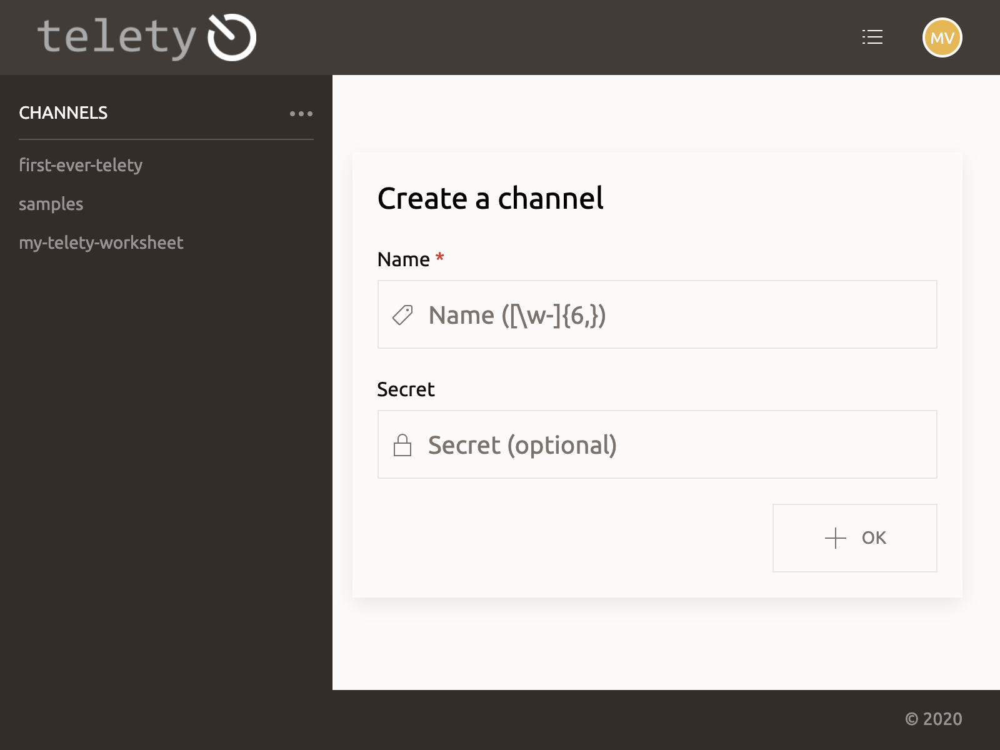
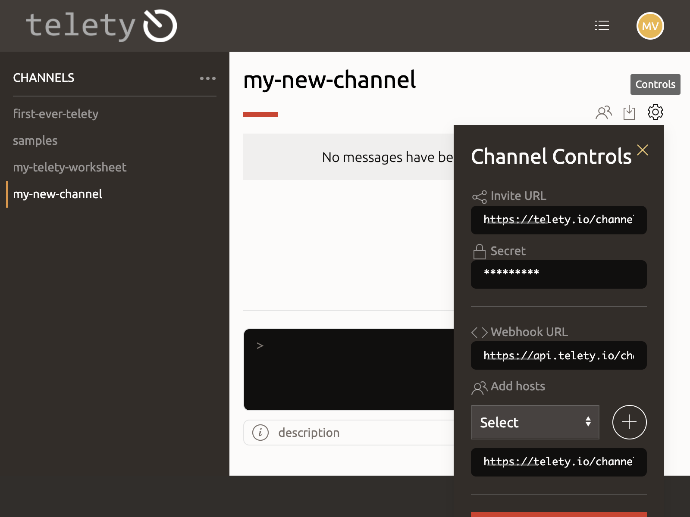
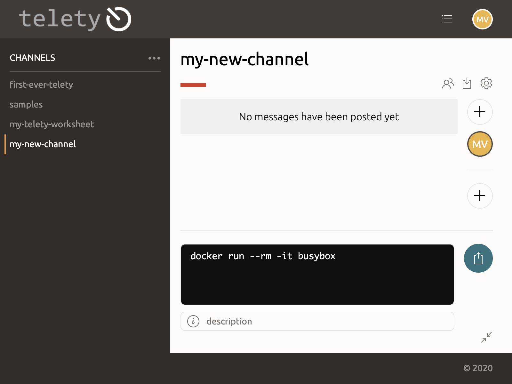
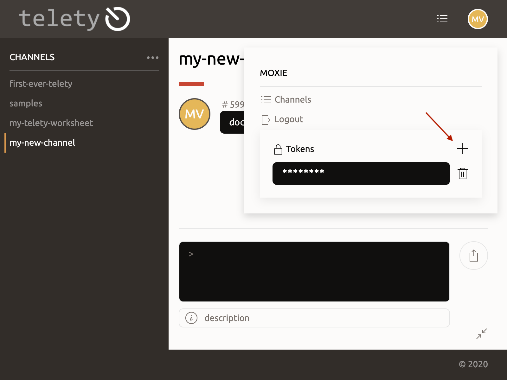
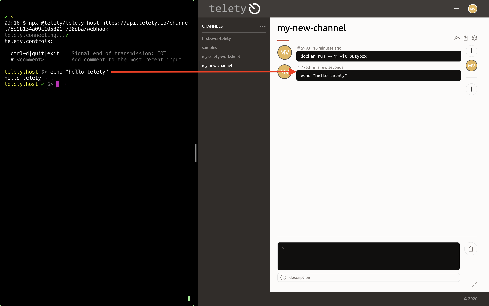
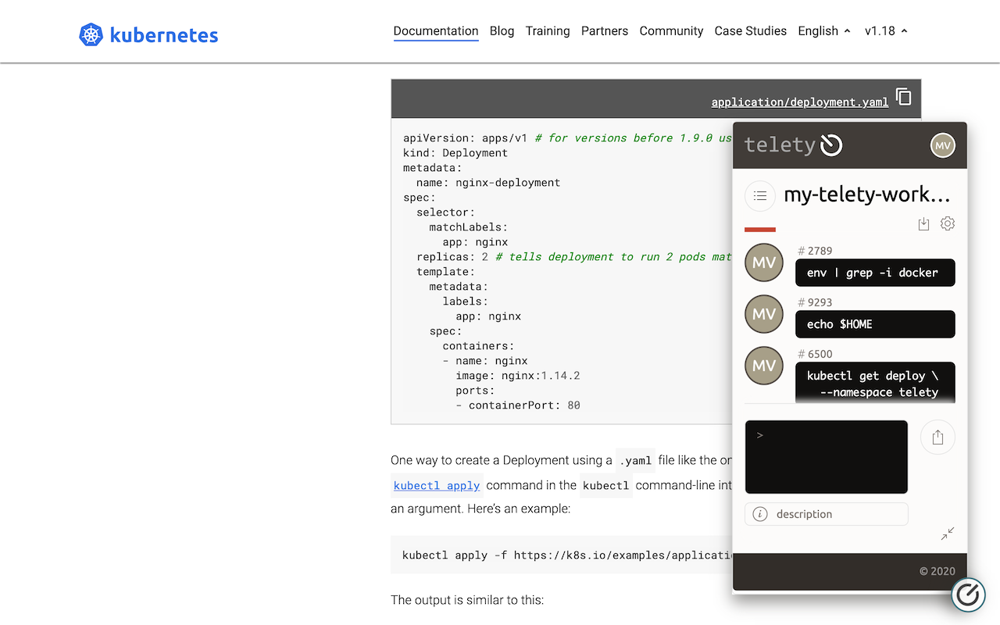
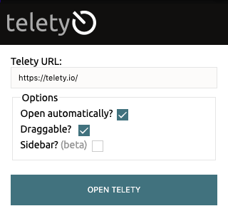

# Welcome to `telety.io`


👩‍💻The `telety` project was created to facilitate real-time code delivery for on-site and especially virtual settings.

`</>` Useful for presenter-led workshops and training, the application provides real-time streaming of code snippets and TTY inputs to a collaborative space.

⚡Every command or snippet is securely delivered to each participant immediately, with the ability to edit inline and copy directly for use.

↖️ In addition to running as a standalone application, telety can be easily embedded like a chat window onto most web interfaces thereby supplementing any console, documentation, presentations, or similar.

---

## Features

- **Host/Guest accounts:** Invite participants to join a hosted channel, whether or not they're registered `telety.io` users.
- **Multi-host capability:** Each channel supports collaborative usage, where any host can contribute snippets.
- **Embeddable browser widget:** Integrate `telety.io` within any web page, or application.
- **Export as markdown:** Every channel transcript can be downloaded as a markdown file.
- **Webhook:** Post messages directly through the webhook
- [Command Line](https://www.npmjs.com/package/@telety/telety)
- [Chrome Extension](https://chrome.google.com/webstore/detail/jdbgkaiicfdjfomknmiknjlkahlhfglg)

## Getting Started

1. Visit [telety.io](https://telety.io/auth) and create an account
1. Click [➕](https://telety.io/channels?create=true) to create a channel

    

    > _Optionally_ provide a secret passphrase for the channel

1. Click ⚙️ to open channel controls. Use these to do the following:

    - Invite users to join the channel
        > 👀 Try this by using a separate browser, and a guest account
    - Add hosts to the channel. **NOTE** hosts must be registered users, and already in the channel
    - Getting the `webhook` endpoint

    

1. Post a snippet to the channel:

    

## CLI

The [`telety.io` command line](../cli) creates a secure connection between the TTY interface, and a channel in your profile.

✨This allows you to host a telety stream directly from your normal flow in the
terminal.

### Setup

1. Create an authentication token and copy to the clipboard:

    

1. Set environment variable

    ```sh
    export TELETY_TOKEN=0000eeee-ddd4-aaa2-bbb1-cccccccfffff
    ```

### Host from CLI

1. 🔗 Open channel controls and copy the webhook URL.
1. Start the CLI with `npx`

    ```sh
    npx @telety/telety host https://api.telety.io/channel/xxxxx/webhook
    ```

1. ❤️ Enter commands as usual. Demonstrate concepts, show debugging, whatever your heart desires. Each command will be shared directly to the `telety.io` channel!

    

## Integration

### Embed Mode

The `telety.io` application can be integrated into most websites, with the use
of a script hosted by telety. Use this script to add a chat-like `telety.io`
widget to web applications, presentations, etc.



Embedding telety can be done in the following ways:

1. With HTML `<script>` tag:

    ```html
    <script src="https://telety.io/embed.telety.min.js?auto=true" async defer></script>
    ```

    > **NOTE:** The query params are used to specify [options](#options) when
    embedding via the script tag.

1. Install the `telety.io` Chrome [extension](https://chrome.google.com/webstore/detail/jdbgkaiicfdjfomknmiknjlkahlhfglg). This is the **easiest** way to test telety on a website without doing any integration work. Note that the functionality may be limited depending on the sites content security policies.

    

#### Options

The embed script may often be used without the `?auto=true` query parameter.
In this way, the embedded telety widget may be used programmatically.

```html
<script src="https://telety.io/embed.telety.min.js"></script>
<script type="text/javascript">
  Telety.init({
    // options
  });
</script>
```

```javascript
{
  /** init automatically */
  auto: false,
  /** open automatically after init */
  open: false,
  /** open directly to a channel */
  channel: null,
  /** draggable */
  draggable: true,
  /** present as sidebar (not draggable) */
  sidebar: false,
  /** target element selector */
  targetElement: 'body',
  /** iframe sandbox */
  sandbox: 'allow-forms allow-scripts allow-same-origin',
};
```

> Telety JavaScript options
